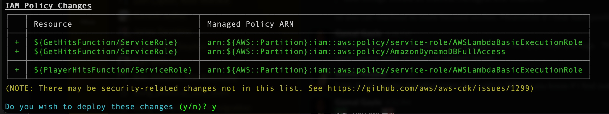
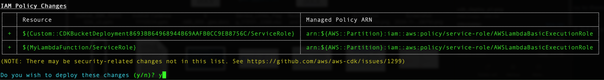
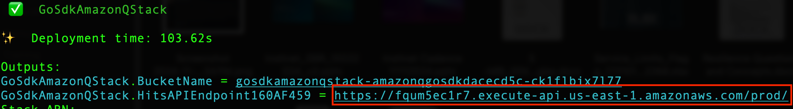
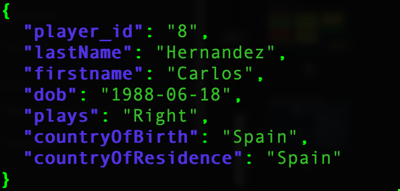

# Welcome to your CDK Go project!

## Prerequisites 

To follow along with this tutorial, you should have the following prerequisites:

* An AWS [account](https://signin.aws.amazon.com/signin?redirect_uri=https%3A%2F%2Fportal.aws.amazon.com%2Fbilling%2Fsignup%2Fresume&client_id=signup)

* [AWS Command Line Interface (CLI)](https://aws.amazon.com/cli/) version 1.25 or later installed and configured on your workstation.

* git, AWS CDK, GO and curl  to deploy and test the application
    * Installation instructions for [git](https://github.com/git-guides/install-git), [AWS CDK](https://docs.aws.amazon.com/cdk/v2/guide/getting_started.html), [CURL](https://curl.se/download.html)

 ## Deploy Sample GO Environment
 The following steps will guide you through deploying the Sample Go project to your account.
1. If you have ***not*** deployed CloudFormation stacks before using **cdk**, you will have to run **'cdk bootstrap'** one time for your account/region.  For more details refer to [cdk bootstrap](https://docs.aws.amazon.com/cdk/v2/guide/ref-cli-cmd-bootstrap.html).  If you have run **'cdk bootstrap'** before please skip this step.
    ```
    $ cdk bootstrap
    ```
2. Next use the **'cdk deploy --all'** command to deploy all stacks to your default AWS account/region.  There are a total of two stacks to deploy '***DynamoDBStack***' and '***GoSdkAmazonQStack***'. 
    ```
    $ cdk deploy --all
    ```
    Type 'y' to confirm the prompt for the '***DynamoDBStack***' stack  'Do you wish to deploy these changes (y/n)?'
    
    

    Type 'y' to confirm the prompt for the '***GoSdkAmazonQStack***' stack  'Do you wish to deploy these changes (y/n)?'  

    <br><br/>

3. When the deploy is complete you will see '***Outputs:***' where you will copy the API Gateway endpoint url for the next step (See Below).
    
    <br><br/>
4. Now that we have to deploy the CDK sample Go stacks. We need to test make the sample application with a curl command and the endpoint url we copied from the previous step.<br><br/>

    ```curl -sX GET "https://{Enter your Hits API Endpoint URL here}/getPlayers/?firstName=Carlos" | jq```<br><br/>

    Make sure to the suffix ***'getPlayers/?firstName=Carlos | jq'*** to your url address. The completed command should look like the following example:<br><br/>
    
    **Example**
    ```
    $ curl -sX GET "https://rxncm1fbxaexample.execute-api.us-east-1.amazonaws.com/prod/getPlayers/?firstName=Carlos" | jq
    ```
5. Run the curl command and confirm you see the following output.

    
 
 

